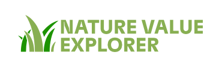
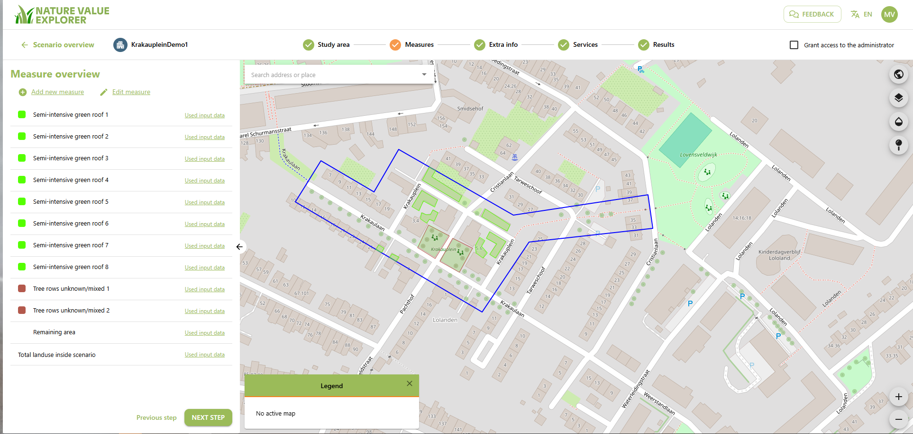
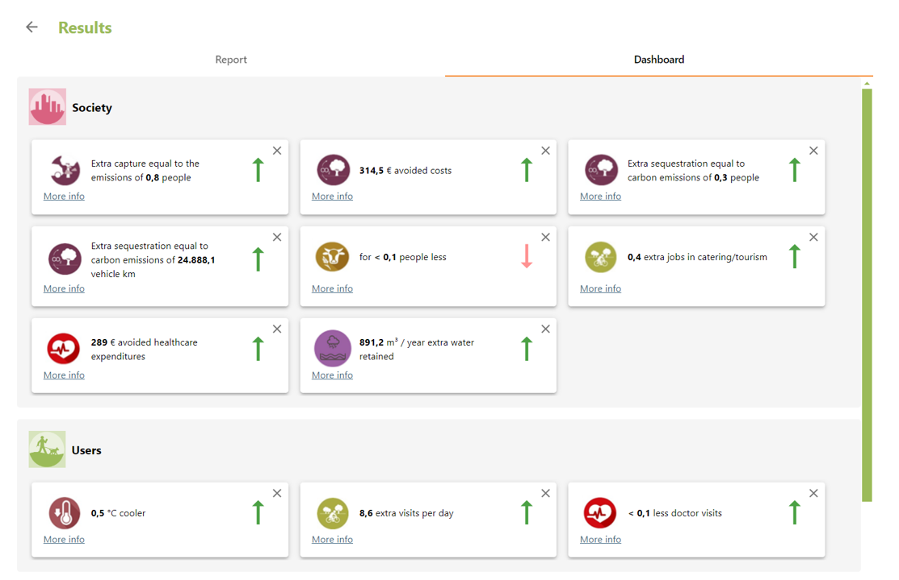
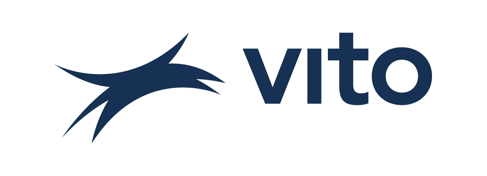

# Nature Value Explorer

## 1. Explore the socio-economic value of nature

Ignoring the value of ecosystem services may lead to unbalanced policy 
and investment decisions.

The [Nature Value Explorer](https://github.com/orgs/URBREATH/repositories) focuses on pragmatic methods
that value these ecosystem services and helps planners,
land managers and policy makers to map nature's socio-economic importance.

The Nature Value Explorer is a [VITO](https://vito.be/en) online tool, that is freely available to use from your web-browser.

In the [Urbreath project](https://urbreath.eu/), we are exploring integrating the tool into the Urbreat Digital Twin solution,
so that multiple cities across Europe can benefit from it.

## 2. VITO

VITO (Flemish Institute for Technological Research) is a leading European, independent research and consultancy organization that develops sustainable technologies in the areas of cleantech and sustainable development, elaborating solutions for the large societal challenges of today.  

 

Our mission is to accelerate the transition to a sustainable society. Therefore, as a research organization, we want to focus on the development of sustainable technologies and be a reliable and connecting partner of and between companies, knowledge centers and governments. As an independent organization, we can use our insights and innovations to strengthen the economic and social fabric in Flanders. 

 

We deliver intelligent and qualitative solutions, from which large and small companies can gain a competitive advantage, as well as objective research, studies and advice, which enable industry and governments to determine their future policy. 

 

In 2023, VITO expanded from 1050 to 1300 employees, amongst whom no fewer than 61 nationalities are represented. The headquarters are located in Mol (Belgium). . During the year 2023, VITO’s total turnover came to a healthy €268 million and the organization produced 277 SCI papers and 25 patent applications. 

 

Our research agenda focuses on today’s major social challenges: climate change, food security, raw materials scarcity, a sustainable energy supply and an ageing population. In this way, VITO supports not only the future vision of Flanders but also the United Nations Sustainable Development Goals.  

## 3. External links

| What?                 | Link |
|-----------------------|------|
| Nature Value Explorer |[NVE webpage](https://www.natuurwaardeverkenner.be/)     |
| VITO                  |https://vito.be/en      |
